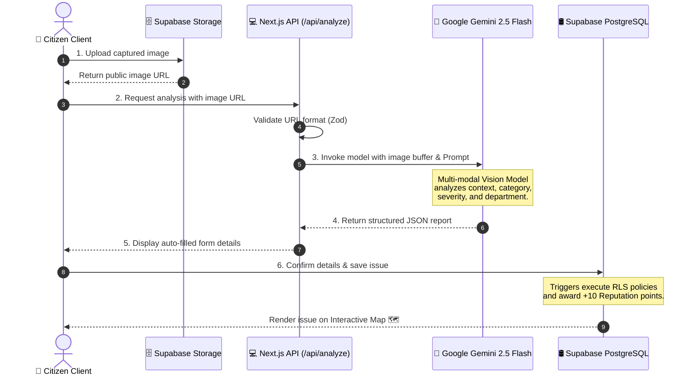

<div align="center">

<!-- Project Header Banner -->
<a href="https://github.com/hetpatel1b/CivicMind-AI">
  
</a>

<br />

<!-- Animated Typing Banner -->
<a href="https://git.io/typing-svg">
  
</a>

<br />

<!-- Shields.io Badges -->
<p align="center">
  <a href="https://nextjs.org/">
    
  </a>
  <a href="https://www.typescriptlang.org/">
    
  </a>
  <a href="https://supabase.com/">
    
  </a>
  <a href="https://ai.google.dev/">
    
  </a>
  <a href="https://tailwindcss.com/">
    
  </a>
  <a href="https://cloud.google.com/run">
    
  </a>
</p>

<p align="center">
  
  
  
  
  
</p>

---

[**🚀 Explore Live Demo**](https://civicmind-ai.com) • [**🐛 Report an Issue**](https://github.com/hetpatel1b/CivicMind-AI/issues) • [**💡 Request Feature**](https://github.com/hetpatel1b/CivicMind-AI/issues) • [**📜 API Documentation**](file:///d:/Het/CivicMind-AI/docs/technical_architecture.md)

</div>

---

## 📖 Overview

**CivicMind AI** is an advanced, AI-powered civic intelligence and community action platform. It empowers citizens to report hyperlocal infrastructural and environmental issues (such as potholes, water leaks, broken streetlights, or illegal garbage dumping) simply by snapping a photo.

By combining the multi-modal reasoning capabilities of **Google Gemini 2.5 Flash** with the reliability of **Supabase PostgreSQL** and **React Leaflet**, CivicMind AI automates report classification, detects duplicate submissions, moderates comments, and runs a gamified reputation economy to reward active civic contributors.

---

## 🚨 Problem Statement

Modern municipal reporting mechanisms are plagued by:
- **High Friction:** Lengthy reporting forms, manual category mapping, and confusing interfaces.
- **Opacity & Delayed Action:** Reported issues vanish into black-box tracking systems with little feedback.
- **Inundation of Spam & Duplicates:** City officials receive hundreds of redundant reports for the same pothole or water leak.
- **Lack of Civic Motivation:** Citizens lack active encouragement or visible impact metrics to continue participating.

---

## 💡 Why CivicMind AI?

Traditional systems rely on tedious forms and manual government sorting. CivicMind AI shifts the paradigm:

```
┌────────────────────────┐       ┌────────────────────────┐       ┌────────────────────────┐
│     AI-AUTOMATED       │       │    CROWD CONSENSUS     │       │    GAMIFIED REWARDS    │
│ Upload photos. Gemini  │ ───>  │ Upvotes build trust,   │ ───>  │ Earn reputation levels │
│ classifies severity,   │       │ duplicates merge, RLS  │       │ & unlock badges for    │
│ category & department. │       │ safeguards operations. │       │ active participation.  │
└────────────────────────┘       └────────────────────────┘       └────────────────────────┘
```

---

## ✨ Key Features

### 🤖 AI Intelligence Features
- **Multi-Modal Analysis (`analyzeCivicIssueImage`):** Processes public Supabase Storage image URLs via **Gemini 2.5 Flash**, extracting the issue title, category, severity rating, and recommended department in structured JSON.
- **Civic Chat Assistant (`chatWithAssistant`):** A conversational chatbot integrated directly into the UI, dynamically adjusted using the user's current page context to answer civic procedures and bylaws.
- **Autonomous Duplicate Detection (`detectDuplicateIssue`):** Compares newly submitted reports with recent nearby incidents using spatial proximity and text comparison to avoid database bloat.
- **Smart Moderation Engine (`analyzeCommentModeration` / `generateModerationInsights`):** Automatically flags toxic comments and filters inappropriate submissions.
- **Discussion Summarizer (`generateDiscussionSummary`):** Summarizes massive public discussion threads on hot issues to give admins quick takeaways.

### 👥 Citizen Engagement Features
- **Frictionless Camera Reporting:** A 4-step wizard (Upload 📸 -> AI Verify Details 📝 -> Map Location Picker 🗺️ -> Submit) that takes under 15 seconds.
- **Geographic Issue Pinpointing:** Visualizes issues on an interactive map using **Leaflet** and **OpenStreetMap**.
- **Consensus Verification Engine:** Upvote and downvote systems allowing citizens to vouch for reported issues, automatically elevating critical issues.
- **Hyperlocal Community Feed:** Scrollable feed displaying real-time reports sorted by proximity, age, or severity.

### 🏛️ Government & Admin Dashboard Features
- **Weekly Dashboard Digest (`generateUserDashboardDigest`):** Weekly AI-compiled summary of municipal health.
- **Dynamic Charts (`generateChartExplanation`):** Interactive visualization of issues by category, resolution rates, and departmental delays powered by **Recharts**.
- **Automated Routing:** Matches issues to municipal departments (e.g., Road Maintenance, Sanitation) using AI recommendation.

### 🏆 Gamification & Badges Economy
- **Reputation Points System:** Accumulate points through concrete activities:
  - **Issue Reported:** `+10 pts`
  - **Issue Supported:** `+2 pts`
  - **Comment Created:** `+3 pts`
  - **Issue Verified by Consensus:** `+20 pts`
  - **Issue Resolved by Authority:** `+50 pts`
- **Dynamic User Tiers:**
  - `0 - 49 pts`: **Citizen**
  - `50 - 149 pts`: **Active Citizen**
  - `150 - 299 pts`: **Community Leader**
  - `300+ pts`: **Civic Champion**
- **Badge Rules Engine (`badges.ts`):** Evaluates user profiles and unlocks achievements:
  - 📣 **First Reporter:** Earned at `10 pts`
  - 📈 **Active Citizen:** Earned at `50 pts`
  - 🏅 **Community Leader:** Earned at `150 pts`
  - 🏆 **Civic Champion:** Earned at `300 pts`

---

## 🛠️ Technology Stack

| Component | Technology | Description | Badge |
| :--- | :--- | :--- | :--- |
| **Frontend Framework** | Next.js 16.2.9 | Modern React Server Components, Server Actions, & App Routing |  |
| **UI Library** | React 19.2.4 | Bleeding-edge reactive state handling and server execution |  |
| **Styling** | Tailwind CSS v4 | Class-based CSS architecture with custom PostCSS plugins |  |
| **Animations** | Framer Motion | Smooth state transitions and landing-page micro-interactions |  |
| **AI SDK** | `@google/genai` (v2.9.0) | Standard client for Gemini API invocation |  |
| **Database & Storage** | Supabase | Postgres engine, storage buckets, and auth handler |  |
| **Geospatial Maps** | React Leaflet | Open-source map layer with custom marker clusters |  |
| **Dashboard Charts** | Recharts | Composable dashboard statistics and vector charts |  |

---

## 📐 Architecture & System Design

### 🔄 Technical Flow

The following diagram illustrates the lifecycle of an issue report, from image upload to AI extraction and database persistence:



### 🛢️ Database ER Diagram

The database structure relies on Supabase Postgres. Relations, views, and indexes are configured via migration scripts in [supabase/migrations](file:///d:/Het/CivicMind-AI/supabase/migrations):


---

## 📂 Folder Structure

```
CivicMind-AI/
├── docs/                    # Technical documentation & PRD
│   ├── PRD.md               # Product Requirements Document
│   ├── ai_workflow.md       # AI processing details & prompt layers
│   ├── database_architecture.md
│   ├── implementation_roadmap.md
│   └── technical_architecture.md
├── supabase/                # Database migrations & seed files
│   ├── migrations/          # Incremental database schema definition scripts
│   │   ├── 00000_init_schema.sql
│   │   ├── 00001_add_missing_tables.sql
│   │   ├── 00002_add_missing_constraints.sql
│   │   ├── 00003_optimize_indexes.sql
│   │   ├── 00004_rls_policies.sql
│   │   ├── 00005_fix_service_compatibility.sql
│   │   ├── 00006_add_assignment_fields.sql
│   │   └── 00007_unified_business_logic.sql
│   └── schema.sql           # Initial database schema snapshot
└── web/                     # Next.js 16 Web Application
    ├── app/                 # Next.js App Router (pages & server actions)
    │   ├── api/             # Secure API Routes (AI analysis, chat assistant, moderation)
    │   │   ├── analyze/     # Gemini Vision image analysis endpoint
    │   │   ├── assistant/   # AI chat assistant session controller
    │   │   └── ...
    │   ├── dashboard/       # Citizen dashboard with interactive charts & AI digest
    │   ├── feed/            # Hyperlocal community issue feed
    │   ├── map/             # Interactive geographic leaflet map
    │   ├── report/          # Multi-step AI-assisted issue reporting form
    │   ├── layout.tsx       # Root layout configuration
    │   └── page.tsx         # landing page
    ├── components/          # Reusable React components (structured by feature)
    │   ├── dashboard/       # Dashboard widgets, stats & summaries
    │   ├── map/             # Map views, marker clusters, region overlays
    │   ├── report/          # Stepper, image uploaders, AI suggestions
    │   └── ui/              # Shadcn primitive elements
    ├── features/            # Feature-specific logic hooks and state
    ├── hooks/               # Custom React hooks (auth, geolocation)
    ├── lib/                 # Core utility libraries (AI config, rate limiting, logging)
    ├── providers/           # Context providers (auth, theme)
    ├── services/            # Backend integration layer
    │   ├── gemini.ts        # Google Gemini 2.5 Flash SDK integrations
    │   ├── reputation.ts    # Centralized points computation economy
    │   ├── badges.ts        # Gamification badge rules engine
    │   └── ...
    ├── types/               # TypeScript interfaces & definitions
    ├── utils/               # General utility helper functions
    ├── next.config.ts       # Next.js build compilation settings
    ├── package.json         # Project manifests and packages
    └── tsconfig.json        # TypeScript compiler configurations
```

---

## 🚀 Installation & Local Setup

### 1. Prerequisites
- **Node.js** version 18.x or higher
- **NPM** or **PNPM** package manager
- **Supabase CLI** (optional for local migrations)
- **Google Gemini API Key** (from Google AI Studio)

### 2. Repository Cloning
```bash
git clone https://github.com/hetpatel1b/CivicMind-AI.git
cd CivicMind-AI/web
```

### 3. Setup Environment Variables
Create a `.env.local` file inside the `web` folder:
```env
# Supabase Configuration
NEXT_PUBLIC_SUPABASE_URL=https://your-project.supabase.co
NEXT_PUBLIC_SUPABASE_ANON_KEY=eyJhbGciOiJIUzI1NiIsInR5cCI6IkpXVCJ9...
SUPABASE_SERVICE_ROLE_KEY=eyJhbGciOiJIUzI1NiIsInR5cCI6IkpXVCJ9...

# AI Services Configuration
GEMINI_API_KEY=AIzaSyA1...
```

### 4. Database Setup
To set up the database schema on your Supabase instance, execute the SQL files inside `supabase/migrations/` sequentially inside your Supabase SQL Editor:
1. Run [00000_init_schema.sql](file:///d:/Het/CivicMind-AI/supabase/migrations/00000_init_schema.sql)
2. Run [00001_add_missing_tables.sql](file:///d:/Het/CivicMind-AI/supabase/migrations/00001_add_missing_tables.sql)
3. Run [00002_add_missing_constraints.sql](file:///d:/Het/CivicMind-AI/supabase/migrations/00002_add_missing_constraints.sql)
4. Run [00003_optimize_indexes.sql](file:///d:/Het/CivicMind-AI/supabase/migrations/00003_optimize_indexes.sql)
5. Run [00004_rls_policies.sql](file:///d:/Het/CivicMind-AI/supabase/migrations/00004_rls_policies.sql)
6. Run [00005_fix_service_compatibility.sql](file:///d:/Het/CivicMind-AI/supabase/migrations/00005_fix_service_compatibility.sql)
7. Run [00006_add_assignment_fields.sql](file:///d:/Het/CivicMind-AI/supabase/migrations/00006_add_assignment_fields.sql)
8. Run [00007_unified_business_logic.sql](file:///d:/Het/CivicMind-AI/supabase/migrations/00007_unified_business_logic.sql)

### 5. Install Dependencies & Launch
```bash
npm install
npm run dev
```
Open [http://localhost:3000](http://localhost:3000) in your browser.

---

## ☁️ Deployment

### Google Cloud Run Deployment (Recommended)

To deploy Next.js with serverless rendering to Cloud Run, containerize the application using Docker's multi-stage builds.

#### 1. Dockerfile configuration
Create a `Dockerfile` inside the `/web` directory:

```dockerfile
# Multi-Stage Build Dockerfile for Next.js Standalone
FROM node:18-alpine AS base

# Install dependencies only when needed
FROM base AS deps
RUN apk add --no-cache libc6-compat
WORKDIR /app
COPY package.json package-lock.json ./
RUN npm ci

# Rebuild the source code only when needed
FROM base AS builder
WORKDIR /app
COPY --from=deps /app/node_modules ./node_modules
COPY . .
ENV NEXT_TELEMETRY_DISABLED 1
RUN npm run build

# Production image, copy all the files and run next
FROM base AS runner
WORKDIR /app
ENV NODE_ENV production
ENV NEXT_TELEMETRY_DISABLED 1

RUN addgroup --system --gid 1001 nodejs
RUN adduser --system --uid 1001 nextjs

COPY --from=builder /app/public ./public
COPY --from=builder --chown=nextjs:nodejs /app/.next/standalone ./
COPY --from=builder --chown=nextjs:nodejs /app/.next/static ./.next/static

USER nextjs
EXPOSE 3000
ENV PORT 3000

CMD ["node", "server.js"]
```

#### 2. Build & Deploy using Google Cloud CLI
Ensure you have authenticated your gcloud CLI, then execute:

```bash
# 1. Submit build container to Google Container Registry
gcloud builds submit --tag gcr.io/your-project-id/civicmind-ai-web:latest

# 2. Deploy service on Cloud Run
gcloud run deploy civicmind-ai-service \
    --image gcr.io/your-project-id/civicmind-ai-web:latest \
    --platform managed \
    --region us-central1 \
    --allow-unauthenticated \
    --set-env-vars="NEXT_PUBLIC_SUPABASE_URL=https://your-project.supabase.co,NEXT_PUBLIC_SUPABASE_ANON_KEY=your_key,GEMINI_API_KEY=your_gemini_key"
```

---

## 🎨 Interactive Interface Mockups

Here is a visual structural layout of the main pages of CivicMind AI:

### 1. Citizen Dashboard
```
┌─────────────────────────────────────────────────────────────────────────────┐
│  CivicMind AI    [🗺️ Map]  [📸 Report]  [📊 Dashboard]   [👤 John Doe (340 pts)] │
├─────────────────────────────────────────────────────────────────────────────┤
│  👋 Welcome Back, John! (Level: Community Leader)                          │
│                                                                             │
│  ┌──────────────────────┐ ┌──────────────────────┐ ┌──────────────────────┐  │
│  │ 📸 Reports Filed: 12  │ │ 🤝 Supports Given: 45│ │ 🏆 Badges Earned: 3  │  │
│  └──────────────────────┘ └──────────────────────┘ └──────────────────────┘  │
│                                                                             │
│  ┌────────────────────────────────────────┐ ┌─────────────────────────────┐  │
│  │ 🗺️ Hyperlocal Map Preview              │ │ 🤖 Gemini Weekly AI Digest   │  │
│  │  ┌──────────────────────────────────┐  │ │ "Good job! Civic activity    │  │
│  │  │ [●] Water Leakage (Critical)     │  │ │ in your neighborhood has    │  │
│  │  │ [●] Pothole (Medium)             │  │ │ resolved 3 road issues    │  │
│  │  │ [●] Broken Light (Low)           │  │ │ this week. Nearby pothole   │  │
│  │  └──────────────────────────────────┘  │ │ needs consensus upvotes."   │  │
│  └────────────────────────────────────────┘ └─────────────────────────────┘  │
└─────────────────────────────────────────────────────────────────────────────┘
```

### 2. Multi-Step AI Reporting Form
```
┌─────────────────────────────────────────────────────────────────────────────┐
│ 📸 New Issue Report                                                         │
├─────────────────────────────────────────────────────────────────────────────┤
│  [ Step 1: Upload ] ───> [● Step 2: AI Verify ] ───> [ Step 3: Location ]   │
│                                                                             │
│  ┌───────────────────────────────────────────────────────────────────────┐  │
│  │ 🤖 Gemini AI analysis finished! Please verify the details below:     │  │
│  │                                                                       │  │
│  │  * Title: Water Main Burst on 5th Avenue                              │  │
│  │  * Category: Water Leakage                                            │  │
│  │  * Severity: CRITICAL  🔴                                             │  │
│  │  * Department Route: Water Department                                 │  │
│  │  * Confidence Score: 98.4%                                            │  │
│  └───────────────────────────────────────────────────────────────────────┘  │
│                                                                             │
│  [ Edit Fields Manual ]                                  [ Confirm Details ]│
└─────────────────────────────────────────────────────────────────────────────┘
```

---

## 📈 Future Roadmap

The roadmap charts our development goals:

```
┌─────────────────────────────────────────────────────────────────────────────────┐
│  Timeline & Goals                                                               │
├─────────────────────────────────────────────────────────────────────────────────┤
│  [✓] Phase 1: Gemini 2.5 Flash Vision Model Integration (Core AI Engine)        │
│  [✓] Phase 2: Supabase database setup with Row Level Security (RLS) policies     │
│  [✓] Phase 3: Interactive Leaflet Map plotting geo-locations                    │
│  [✓] Phase 4: Gamified reputation points economy and badges algorithm           │
│  [ ] Phase 5: Municipal integration via webhooks to transmit reports to ERPs   │
│  [ ] Phase 6: Machine learning models predicting road decay via historic reports│
│  [ ] Phase 7: React Native mobile application for Android and iOS app stores   │
└─────────────────────────────────────────────────────────────────────────────────┘
```

---

## ⚙️ Performance, Security & Accessibility

### ⚡ Performance Optimization
- **Stand-alone builds:** Configured multi-stage build caching for minimal docker footprint.
- **Dynamic Leaflet Import:** Leaflet is imported dynamically on the client side using Next.js `next/dynamic` with `ssr: false` to avoid server rendering overhead and layout thrashing.
- **Client-side Image Scaling:** Images are compressed and resized using HTML Canvas before triggering `/api/analyze` requests to reduce upload payload.

### 🛡️ Security Implementation
- **Row Level Security (RLS):** Policies set on every database table so users can only write to their own profile, submit issues for their accounts, and delete their own support tags.
- **Zod Data Sanitization:** Strict Zod parsing on API endpoints prevents malicious payloads and SQL injections.
- **Gemini API Protection:** The Google AI Studio keys never leak to the client; all transactions occur securely via Next.js server-side endpoint headers.

### ♿ Accessibility
- **WCAG 2.1 Compliance:** Implements semantic HTML elements (`<main>`, `<header>`, `<nav>`) and high-contrast color configurations.
- **Accessible Interactions:** Leverages Radix UI primitives (via Shadcn) to support keyboard focus states, aria-labels, and modal-dialog traps.

---

## 🤝 Contributing

Contributions to CivicMind AI are highly appreciated! Please follow these guidelines:

1. **Fork the Repository** on GitHub.
2. **Create a Feature Branch:** `git checkout -b feature/amazing-feature`
3. **Commit Your Changes:** `git commit -m 'Add some amazing feature'`
4. **Push to the Branch:** `git push origin feature/amazing-feature`
5. **Open a Pull Request** for code review.

---

## 📜 License

This project is licensed under the MIT License - see the [LICENSE](LICENSE) file for details.

---

## 🙏 Acknowledgements

- **VibeToShip 2026 Hackathon:** For the "Community Hero" challenge statement.
- **Google AI Studio:** For providing fast access to Gemini 2.5 Flash endpoints.
- **Supabase Core Team:** For the robust auth helpers and real-time Postgres wrappers.
- **Shadcn UI Designers:** For the beautifully crafted component architecture.

---

## 👥 Core Team & Contact

- **Het Patel** - *Solo Developer / Full Stack Engineer*
  - **GitHub:** [@hetpatel1b](https://github.com/hetpatel1b)
  - **Email:** het@civicmind-ai.com
  - **Website:** [hetpatel.dev](https://hetpatel.dev)

---

<div align="center">

### Star the Repository! ⭐
If you find this project useful or inspirational for hackathons, please consider giving it a star! It directly helps other developers find and build upon our work.

<sub>Built with ❤️ for a better, smarter community.</sub>

</div>
