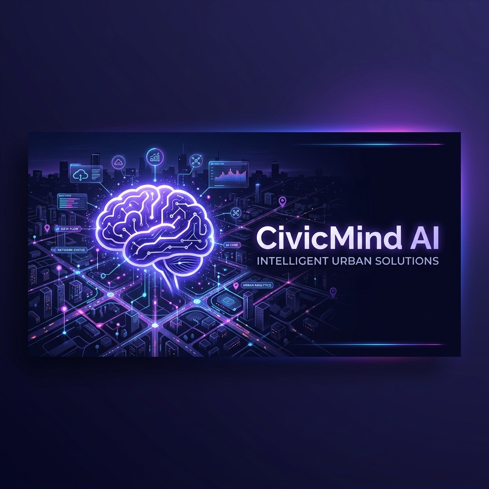
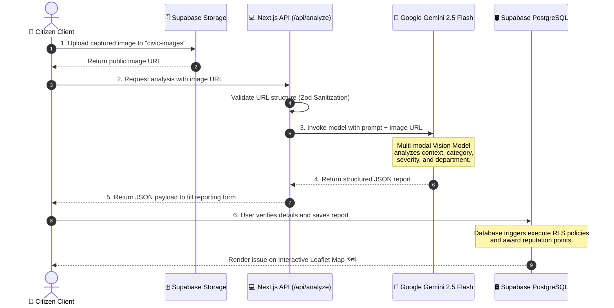
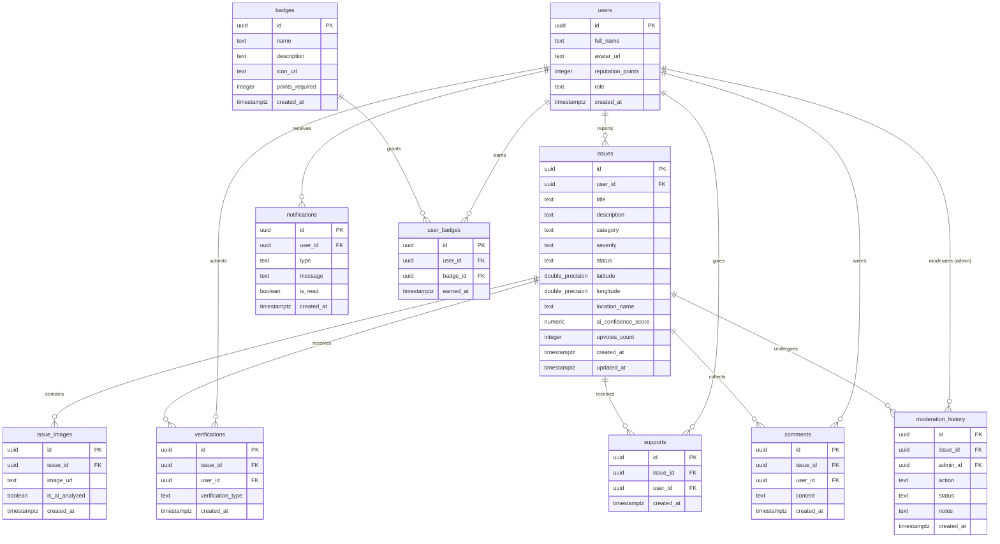
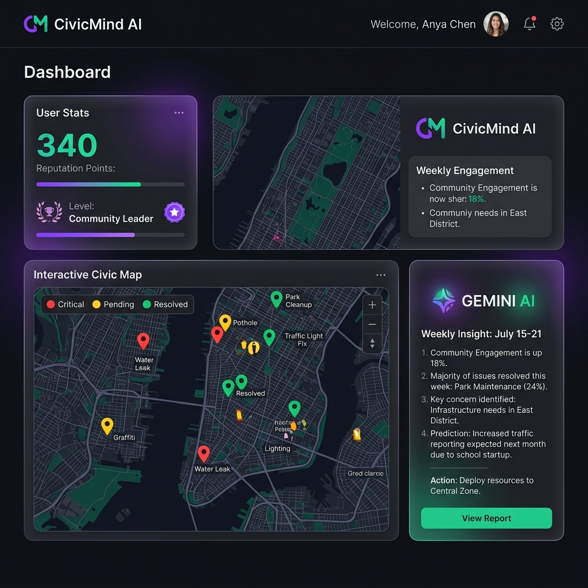
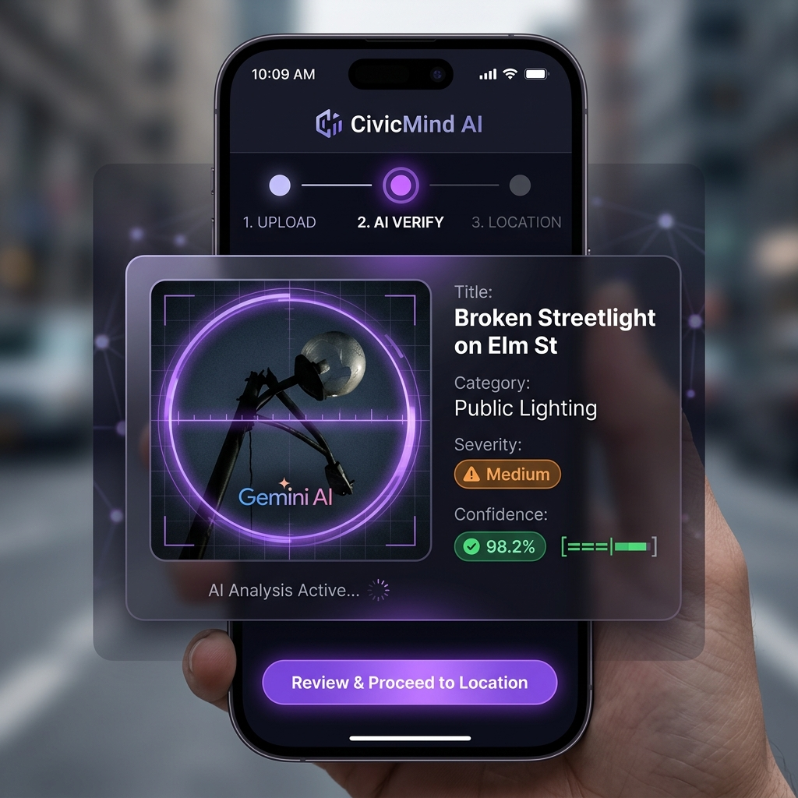

<!--
# CivicMind AI - GitHub Repository README
# Optimized for: GitHub Light & Dark Modes, Search Engine Optimization (SEO), Technical Completeness
-->

<div align="center">

<!-- Project Header Banner -->


<br />

<!-- Animated Typing Banner -->
<a href="https://github.com/hetpatel1b/CivicMind-AI">
  
</a>

<br />

<!-- Shields.io Badges -->
<p align="center">
  <a href="https://nextjs.org/">
    
  </a>
  <a href="https://react.dev/">
    
  </a>
  <a href="https://www.typescriptlang.org/">
    
  </a>
  <a href="https://supabase.com/">
    
  </a>
  <a href="https://ai.google.dev/">
    
  </a>
  <a href="https://tailwindcss.com/">
    
  </a>
  <a href="https://cloud.google.com/run">
    
  </a>
</p>

<!-- GitHub Social Badges -->
<p align="center">
  <a href="https://github.com/hetpatel1b/CivicMind-AI/stargazers">
    
  </a>
  <a href="https://github.com/hetpatel1b/CivicMind-AI/network/members">
    
  </a>
  <a href="https://github.com/hetpatel1b/CivicMind-AI/issues">
    
  </a>
  <a href="https://github.com/hetpatel1b/CivicMind-AI/pulls">
    
  </a>
  <a href="https://github.com/hetpatel1b/CivicMind-AI/blob/main/LICENSE">
    
  </a>
</p>

---

[**🚀 Explore Live Demo**](https://civicmind-ai.com) • [**🐛 Report an Issue**](https://github.com/hetpatel1b/CivicMind-AI/issues) • [**💡 Request Feature**](https://github.com/hetpatel1b/CivicMind-AI/issues) • [**📜 API Documentation**](docs/technical_architecture.md)

</div>

---

## 📖 Overview

**CivicMind AI** is a production-grade, AI-powered civic intelligence and community action platform. It empowers citizens to report hyperlocal infrastructural, environmental, and safety issues (such as potholes, water main breaks, damaged streetlights, and illegal dumping) in under 15 seconds by simply snapping a photo.

By combining the multi-modal intelligence of **Google Gemini 2.5 Flash** with the speed of **Next.js 16 (App Router)** and the secure backend logic of **Supabase PostgreSQL**, CivicMind AI automates report classification, detects duplicate submissions, routes issues to correct municipal departments, moderates public discourse, and fosters a gamified reputation economy to reward active civic contributors.

---

## 🚨 Problem Statement & Solution

### The Friction in Modern Municipal Reporting
1. **High Reporting Friction:** Citizens face lengthy forms, manual routing, and clunky interfaces, resulting in under-reporting.
2. **Opacity & Lack of Feedback:** Reported issues enter bureaucratic black-box tracking systems with little feedback or updates.
3. **Data Bloat & Duplicates:** City officials receive hundreds of redundant reports for the same street pothole or broken light.
4. **Lack of Civic Motivation:** Citizens lack visual impact metrics or active encouragement to participate.

### CivicMind AI's Paradigm Shift
```
┌─────────────────────────────────┐      ┌─────────────────────────────────┐      ┌─────────────────────────────────┐
│     AI-AUTOMATED CAPTURE        │      │      CROWD CONSENSUS            │      │      GAMIFIED REWARDS           │
│ Citizens snap a photo. Gemini   │ ───> │ Upvotes build community trust,  │ ───> │ Earn reputation points & badges.│
│ extracts category, severity,   │      │ duplicates merge, and RLS      │      │ Transition from 'Citizen' to    │
│ and department details.         │      │ policies secure operations.     │      │ 'Civic Champion'.               │
└─────────────────────────────────┘      └─────────────────────────────────┘      └─────────────────────────────────┘
```

---

## ✨ Key Features

<div align="center">
  <table width="100%">
    <tr>
      <td width="50%" valign="top">
        <h3>🤖 AI Issue Detection</h3>
        <p>Uses Gemini 2.5 Flash Vision to extract titles, detailed descriptions, category tags, severity ratings, and responsible municipal departments directly from photos.</p>
      </td>
      <td width="50%" valign="top">
        <h3>🗺️ Interactive Geospatial Maps</h3>
        <p>Enables citizens to pinpoint coordinates visually using Leaflet Maps and OpenStreetMap, with custom marker clusters, search bounds, and drag-and-drop support.</p>
      </td>
    </tr>
    <tr>
      <td width="50%" valign="top">
        <h3>🤝 Community Consensus Feed</h3>
        <p>Allows citizens to upvote, comment, and verify reports. Autonomous duplicate checking prevents data bloat by merging reports with nearby issues.</p>
      </td>
      <td width="50%" valign="top">
        <h3>🏆 Gamified Reputation Economy</h3>
        <p>Users earn reputation points for active reporting, comments, and verifications, unlocking custom badges (e.g., First Reporter, Civic Champion) and ranks.</p>
      </td>
    </tr>
    <tr>
      <td width="50%" valign="top">
        <h3>💬 Context-Aware AI Assistant</h3>
        <p>An in-app chat widget that dynamically updates its context based on the user's active page, answering questions about city ordinances and bylaws.</p>
      </td>
      <td width="50%" valign="top">
        <h3>🏛️ Municipal Dashboard Digest</h3>
        <p>Aggregates municipal analytics using Recharts. Provides administrative tools for tracking unresolved cases and reading AI-generated health summaries.</p>
      </td>
    </tr>
  </table>
</div>

---

## 🛠️ Tech Stack & Architecture

### Technology Breakdown

*   **Frontend Framework:** [Next.js 16.2.9](https://nextjs.org/) (App Router, Server Actions, SSR/SSG compilation optimization)
*   **UI Library:** [React 19.2.4](https://react.dev/) (Concurrent rendering, Suspense fallbacks)
*   **Styling Engine:** [Tailwind CSS v4.0](https://tailwindcss.com/) (Class-based CSS architecture with PostCSS optimization)
*   **Animations:** [Framer Motion 12.4.2](https://www.framer.com/motion/) (Smooth layout changes and page-transition animations)
*   **AI Integration:** [`@google/genai` (v2.9.0)](https://github.com/google/generative-ai-js) (Official Google Gemini AI SDK)
*   **Backend & DB:** [Supabase](https://supabase.com/) (PostgreSQL database, Storage Buckets, and OAuth Authentication)
*   **Geospatial Library:** [React Leaflet 5.0.0](https://react-leaflet.js.org/) (Leaflet-wrapper components for interactive client maps)
*   **Analytics & Charts:** [Recharts 3.9.0](https://recharts.org/) (Sleek svg charts for dashboard statistics)
*   **Data Validation:** [Zod 4.4.3](https://zod.dev/) (Form parsing and strict JSON API boundary validation)

---

## 📐 Architecture & System Design

### AI Processing Flow

The diagram below details the sequence from image capture to database persistence, including the secure API broker layer:



### Database ER Diagram

The PostgreSQL relational structure mapping is managed via migrations in the [supabase/migrations](supabase/migrations) directory:



<details>
<summary>🔑 Click to view Database Tables Schema & SQL details</summary>

The schema enforces Row Level Security (RLS) and handles gamification triggers:
*   `users`: Tracks names, profile avatars, reputation points, roles (`citizen`, `moderator`, `admin`).
*   `issues`: Represents reported tickets with geo-coordinates, categories (`Sanitation`, `Infrastructure`, `Water`, `Electricity`, `Safety`, `Other`), severity scores, and resolution status.
*   `verifications` & `supports`: Implements the crowd-voting infrastructure.
*   `user_badges` & `badges`: Gamification assets linked dynamically using user reputation thresholds.

For detailed table columns and indices, see [database_architecture.md](docs/database_architecture.md).

</details>

---

## 🤖 Deep Dive: AI Workflow & Prompt Layers

### 1. Vision Analysis Endpoint (`POST /api/analyze`)
*   **Payload validation:** Client posts the Supabase Storage URL. A Zod schema checks url structure to mitigate Server-Side Request Forgery (SSRF).
*   **Model Config:** Gemini 2.5 Flash is invoked with a temperature coefficient of `0.1` to maximize JSON consistency and deterministic classifications.
*   **System Prompt Layer:**
    ```text
    You are CivicMind AI, an expert municipal infrastructure analyzer. Your task is to analyze images uploaded by citizens and identify civic issues (e.g., potholes, garbage, broken streetlights, water leaks). You must return ONLY a raw, valid JSON object without any markdown formatting, backticks, or extra text. If no issue is found, return a JSON object with 'category': 'None' and 'severity': 'Low'.
    ```
*   **Output Schema Validation:**
    ```json
    {
      "title": "Short, descriptive title of the issue (Max 50 chars)",
      "description": "Detailed explanation of the problem observed in the image",
      "category": "Infrastructure | Sanitation | Water | Electricity | Safety | Other",
      "severity": "Low | Medium | High | Critical",
      "recommended_department": "Name of the municipal department responsible (e.g., Public Works)",
      "confidence_score": 0.95
    }
    ```

### 2. Autonomous Duplicate Detection (`detectDuplicateIssue`)
Before displaying the final reporting step, CivicMind AI compares the new report's geo-coordinates and title with active records in the database.
*   **Spatial boundary check:** Filters issues within a 50-meter radius.
*   **Text matching:** Computes similarity scoring between reports to prevent duplicate tickets and alert the citizen to "merge" with an existing ticket.

### 3. AI Confidence Framework
The application UI dynamically reacts to the Gemini `confidence_score` attribute:
*   **Score >= 0.90 (Critical):** Auto-fills the reporting stepper. User can review and submit with one click.
*   **0.75 <= Score < 0.90 (High):** Auto-fills the form, but adds a subtle styling outline to the category dropdown to draw verification attention.
*   **0.50 <= Score < 0.74 (Medium):** Pre-fills fields but highlights a warning alert: *"AI is uncertain. Please check details manually."*
*   **Score < 0.50 (Low):** Rejects automated fill, sets `is_ai_analyzed = false`, and displays empty inputs for standard user reporting.

---

## 📂 Project Structure

```
CivicMind-AI/
├── docs/                         # Technical documentation & PRD
│   ├── assets/                   # Repository static image assets
│   │   ├── banner.png            # Top header banner
│   │   ├── dashboard_mockup.png  # Dashboard interface mockup screenshot
│   │   └── report_mockup.png     # Reporting form interface mockup screenshot
│   ├── ai_workflow.md            # AI prompt blueprints & pipeline
│   ├── database_architecture.md  # DB structure & RLS details
│   ├── implementation_roadmap.md # Development milestones & status
│   └── technical_architecture.md # Core technical architecture document
├── supabase/                     # Supabase configuration & migrations
│   ├── migrations/               # Incremental PostgreSQL database scripts
│   │   ├── 00000_init_schema.sql
│   │   ├── 00001_add_missing_tables.sql
│   │   ├── 00002_add_missing_constraints.sql
│   │   ├── 00003_optimize_indexes.sql
│   │   ├── 00004_rls_policies.sql
│   │   ├── 00005_fix_service_compatibility.sql
│   │   ├── 00006_add_assignment_fields.sql
│   │   └── 00007_unified_business_logic.sql
│   └── schema.sql                # Initial schema snapshot
└── web/                          # Next.js 16 Web Application Root
    ├── app/                      # Next.js App Router (pages & server actions)
    │   ├── api/                  # Secure API Routes
    │   │   ├── analyze/          # Vision analysis endpoint
    │   │   ├── assistant/        # Chat assistant session controller
    │   │   └── verify/           # Upvote / downvote consensus engine
    │   ├── dashboard/            # Citizen & Moderator dashboard
    │   ├── feed/                 # Proximity-sorted issue feed
    │   ├── map/                  # Leaflet geo-mapping page
    │   ├── report/               # 4-stage wizard report creator
    │   ├── layout.tsx            # App-wide providers & shell layout
    │   └── page.tsx              # Dynamic landing page
    ├── components/               # Custom React components (Shadcn elements)
    ├── hooks/                    # Custom hooks (e.g., useLocation)
    ├── lib/                      # Base service client providers (Supabase)
    ├── services/                 # Business services (e.g., badges.ts, reputation.ts)
    ├── types/                    # Common TypeScript type files
    ├── utils/                    # Base style helpers & formats
    ├── package.json              # App dependencies & configurations
    └── tsconfig.json             # TypeScript compiler settings
```

---

## ⚙️ Environment Variables Setup

Create a `.env.local` file inside the `web/` folder before launching the application locally:

| Variable | Required | Purpose | Example Value |
| :--- | :--- | :--- | :--- |
| `NEXT_PUBLIC_SUPABASE_URL` | **Yes** | Public Supabase endpoint URL | `https://yourproject.supabase.co` |
| `NEXT_PUBLIC_SUPABASE_ANON_KEY` | **Yes** | Client-safe anonymous public key | `eyJhbGciOiJIUzI1NiIsInR5cCI6IkpX...` |
| `SUPABASE_SERVICE_ROLE_KEY` | **Yes** | Server-side key (bypasses RLS triggers) | `eyJhbGciOiJIUzI1NiIsInR5cCI6IkpX...` |
| `GEMINI_API_KEY` | **Yes** | Google AI Studio access token | `AIzaSyD_YourGeminiKeyHere...` |
| `NODE_ENV` | No | App stage environment context | `development` |

---

## 🚀 Installation & Local Setup

Follow these steps to run CivicMind AI on your machine:

### 1. Prerequisite Installations
*   **Node.js** version `18.18.0` or higher
*   **NPM** or **PNPM** package manager
*   **Supabase CLI** (optional, for local postgres debugging)

### 2. Repository Cloning
Clone the repository and move to the web directory:
```bash
git clone https://github.com/hetpatel1b/CivicMind-AI.git
cd CivicMind-AI/web
```

### 3. Configure Local Environment Variables
Create a copy of `.env.example` as `.env.local` inside `/web`:
```bash
cp .env.example .env.local
```
Open `.env.local` and populate it with your Supabase URLs, Service Keys, and your Google Studio `GEMINI_API_KEY`.

### 4. Database Setup
To build the SQL schema in your Supabase project, execute the migration files sequentially in the Supabase SQL editor:
1.  [00000_init_schema.sql](supabase/migrations/00000_init_schema.sql)
2.  [00001_add_missing_tables.sql](supabase/migrations/00001_add_missing_tables.sql)
3.  [00002_add_missing_constraints.sql](supabase/migrations/00002_add_missing_constraints.sql)
4.  [00003_optimize_indexes.sql](supabase/migrations/00003_optimize_indexes.sql)
5.  [00004_rls_policies.sql](supabase/migrations/00004_rls_policies.sql)
6.  [00005_fix_service_compatibility.sql](supabase/migrations/00005_fix_service_compatibility.sql)
7.  [00006_add_assignment_fields.sql](supabase/migrations/00006_add_assignment_fields.sql)
8.  [00007_unified_business_logic.sql](supabase/migrations/00007_unified_business_logic.sql)

### 5. Install Dependencies & Launch
Run the package installations and start the local development server:
```bash
npm install
npm run dev
```
Open [http://localhost:3000](http://localhost:3000) in your web browser.

---

## 🎨 Screenshots & Mockups

### 📊 Citizen Dashboard Interface
Displays real-time citizen stats, recent activity badges, interactive Map preview, and the context-sensitive AI Digest panel.


### 📸 Stepper reporting UI
A 4-step wizard that handles photo uploads, prompts Gemini 2.5 Flash, extracts metadata, and maps location.


---

## ☁️ Deployment

### Serverless Google Cloud Run Containerization (Recommended)

To deploy Next.js with standalone production server execution, utilize a multi-stage Dockerfile optimized to build minimum-weight docker layers.

#### 1. Next.js Standalone Configuration
Ensure `next.config.ts` includes standalone outputting:
```typescript
import type { NextConfig } from 'next';

const nextConfig: NextConfig = {
  output: 'standalone', // Generates isolated node-runner package
};

export default nextConfig;
```

#### 2. Create the web/Dockerfile
Create a `Dockerfile` inside `/web` with the following configuration:
```dockerfile
# Multi-Stage Build Dockerfile for Next.js Standalone
FROM node:18-alpine AS base

# Stage 1: Install dependencies
FROM base AS deps
RUN apk add --no-cache libc6-compat
WORKDIR /app
COPY package.json package-lock.json ./
RUN npm ci

# Stage 2: Rebuild the source code
FROM base AS builder
WORKDIR /app
COPY --from=deps /app/node_modules ./node_modules
COPY . .
ENV NEXT_TELEMETRY_DISABLED 1
RUN npm run build

# Stage 3: Runner
FROM base AS runner
WORKDIR /app
ENV NODE_ENV production
ENV NEXT_TELEMETRY_DISABLED 1

RUN addgroup --system --gid 1001 nodejs
RUN adduser --system --uid 1001 nextjs

COPY --from=builder /app/public ./public
COPY --from=builder --chown=nextjs:nodejs /app/.next/standalone ./
COPY --from=builder --chown=nextjs:nodejs /app/.next/static ./.next/static

USER nextjs
EXPOSE 3000
ENV PORT 3000

CMD ["node", "server.js"]
```

#### 3. Build & Deploy using GCloud CLI
Run the following commands in the directory containing the Dockerfile:
```bash
# 1. Build and push container to Google Container Registry
gcloud builds submit --tag gcr.io/your-project-id/civicmind-ai-web:latest

# 2. Deploy service on Cloud Run
gcloud run deploy civicmind-ai-service \
    --image gcr.io/your-project-id/civicmind-ai-web:latest \
    --platform managed \
    --region us-central1 \
    --allow-unauthenticated \
    --set-env-vars="NEXT_PUBLIC_SUPABASE_URL=https://your-project.supabase.co,NEXT_PUBLIC_SUPABASE_ANON_KEY=your_anon_key,GEMINI_API_KEY=your_gemini_key,SUPABASE_SERVICE_ROLE_KEY=your_service_role_key"
```

---

## 📈 Future Roadmap

- [x] **Phase 1:** Google Gemini 2.5 Flash vision parser integration (Core AI Reporting Pipeline).
- [x] **Phase 2:** Supabase database setup with PostgreSQL schema and Row Level Security (RLS) policies.
- [x] **Phase 3:** Interactive React Leaflet Map configuration with clustering markers.
- [x] **Phase 4:** Gamification points system and dynamic badges logic engine.
- [ ] **Phase 5:** Municipal integration via outgoing webhook payloads to route issues into city ERP software.
- [ ] **Phase 6:** Predictive analytics engine mapping seasonal infrastructure decay from historical report datasets.
- [ ] **Phase 7:** Native mobile app packaging (React Native wrapper) for iOS App Store and Google Play Store.

---

## 👥 Contributors & Maintainers

- **Het Patel** - *Lead Full Stack Developer / AI Systems Architect*
  - GitHub: [@hetpatel1b](https://github.com/hetpatel1b)
  - Email: hetpatel1b@gmail.com
  
---

## 🙏 Support & Contact

If you have questions, encounter bugs, or want to contribute to CivicMind AI:
*   Open an issue or PR in the [CivicMind AI Issues Tracker](https://github.com/hetpatel1b/CivicMind-AI/issues).
*   Join the community discussions on our [Discussions Board](https://github.com/hetpatel1b/CivicMind-AI/discussions).

<div align="center">

### Star the Repository! ⭐
If you find CivicMind AI useful for municipal development or hackathon inspiration, please give it a star! It directly helps other open-source developers discover and build upon this platform.

<sub>Built with ❤️ for smarter, cleaner, and safer community ecosystems.</sub>

</div>
