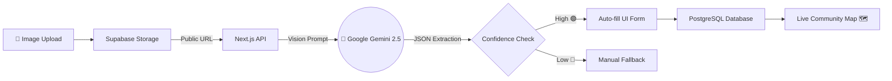

<div align="center">

<a href="https://civicmind-ai.com">
  
</a>

<br />

[](https://git.io/typing-svg)

---

[](https://nextjs.org/)
[](https://www.typescriptlang.org/)
[](https://supabase.com/)
[](https://ai.google.dev/)
[](https://tailwindcss.com/)
[](#)

[**Live Demo**](#) • [**Report a Bug**](#) • [**Request Feature**](#)

</div>

---

<div align="center">
  
</div>

## 🚨 The Problem
Local communities consistently face infrastructural and environmental issues—like open potholes, uncollected garbage, and water leaks. Traditional reporting mechanisms are tedious, lack transparency, and often go unnoticed by authorities. Citizens lack a unified, frictionless platform to report issues, verify them through community consensus, and track their resolution status in real-time.

## 💡 The Solution
**CivicMind AI** transforms civic engagement by making problem reporting as simple as taking a photo. Leveraging **Google Gemini 2.5 Flash**, the platform automatically analyzes images, categorizes the issue, determines its severity, and plots it on a live community map. By introducing crowdsourced verification and gamification, CivicMind AI bridges the gap between citizens and municipal action.

<div align="center">
  
</div>

## ✨ Key Features

| Feature | Description |
| :--- | :--- |
| 📸 **AI Issue Reporting** | Upload a photo, and Gemini AI automatically extracts the title, category, and severity. |
| 🌐 **Community Feed** | A real-time, scrollable timeline of recently reported hyperlocal issues. |
| 🗺️ **Interactive Map** | Geospatial visualization of civic problems powered by React Leaflet and OpenStreetMap. |
| ✅ **Verification System** | Crowdsourced upvoting mechanism to validate genuine issues and flag spam. |
| 📊 **Analytics Dashboard** | City-wide health metrics, most common issues, and resolution tracking for Admins. |
| 🏆 **Gamification** | Earn reputation points and unique badges for reporting and verifying community issues. |

<div align="center">
  
</div>

## 🧠 AI Workflow Architecture



<div align="center">
  
</div>

## 🗄️ Database Design
A robust, relational schema built on **Supabase PostgreSQL** with strict Row Level Security (RLS).
- **`Users`**: Profiles, avatars, role-based access, and reputation points.
- **`Issues`**: The core entity storing category, severity, and geospatial coordinates.
- **`Verifications`**: Tracks user upvotes to calculate an issue's trust score dynamically.
- **`Badges`**: Gamification milestones tied to users.

<div align="center">
  
</div>

## 🚀 Installation & Setup

1. **Clone the repository:**
   ```bash
   git clone https://github.com/hetpatel1b/CivicMind-AI.git
   cd CivicMind-AI/web
   ```

2. **Install dependencies:**
   ```bash
   npm install
   ```

3. **Set up environment variables:**
   Create a `.env.local` file in the `web/` directory and populate the keys:
   ```env
   NEXT_PUBLIC_SUPABASE_URL=your_supabase_url
   NEXT_PUBLIC_SUPABASE_ANON_KEY=your_supabase_anon_key
   SUPABASE_SERVICE_ROLE_KEY=your_supabase_service_role
   GEMINI_API_KEY=your_gemini_api_key
   ```

4. **Start the development server:**
   ```bash
   npm run dev
   ```
   *The app will be running at `http://localhost:3000`.*

<div align="center">
  
</div>

## 🔭 Future Scope
- **Predictive Civic Intelligence:** AI-driven heatmaps predicting future infrastructure failures based on historic data.
- **Direct Municipal Integration:** Automated email dispatch to local authorities via webhook when an issue reaches critical mass.
- **Multilingual Support:** Auto-translating reports using AI to support diverse communities.

<div align="center">
  
</div>

## 👨‍💻 Team
- **HET PRASHANT PATEL** - *Solo Developer / Full Stack Engineer* - [GitHub](https://github.com/hetpatel1b)

## 🙏 Acknowledgements
- **VibeToShip 2026** - For the "Community Hero" problem statement.
- **Google AI Studio** - For powering the core intelligence.
- **Supabase** - For the rapid backend infrastructure.
- **Shadcn** - For the accessible UI components.

---
<div align="center">
  <sub>Built with ❤️ for a better tomorrow.</sub>
</div>
