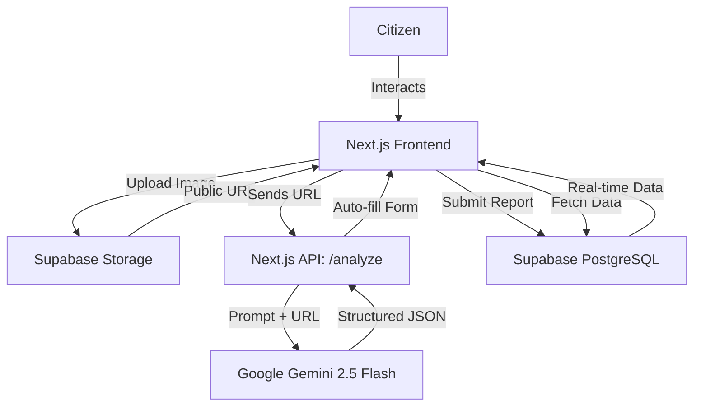
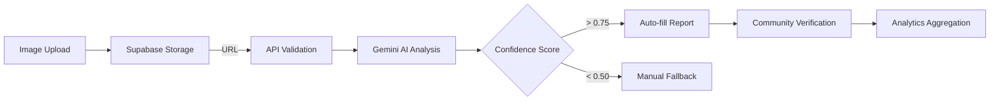

<div align="center">

# 🏙️ CivicMind AI
**AI-Powered Hyperlocal Civic Problem Solver**

[](https://nextjs.org/)
[](https://www.typescriptlang.org/)
[](https://supabase.com/)
[](https://ai.google.dev/)
[](#)

[Live Demo Placeholder] · [Report a Bug](#) · [Request Feature](#)

</div>

---

## 🚨 The Problem
Local communities consistently face infrastructural and environmental issues like open potholes, uncollected garbage, and water leaks. Traditional reporting mechanisms are tedious, lack transparency, and often go unnoticed by authorities. Citizens lack a unified, frictionless platform to report issues, verify them through community consensus, and track their resolution status in real-time.

## 💡 The Solution
**CivicMind AI** transforms civic engagement by making problem reporting as simple as taking a photo. Leveraging Google Gemini 2.5 Flash, the platform automatically analyzes images, categorizes the issue, determines its severity, and plots it on a live community map. By introducing crowdsourced verification and gamification, CivicMind AI bridges the gap between citizens and municipal action.

---

## ✨ Features
- 📸 **AI Issue Reporting:** Upload a photo, and Gemini AI automatically extracts the title, category, and severity.
- 🌐 **Community Feed:** A real-time, scrollable timeline of recently reported hyperlocal issues.
- 🗺️ **Interactive Map:** Geospatial visualization of civic problems powered by React Leaflet and OpenStreetMap.
- ✅ **Verification System:** Crowdsourced upvoting mechanism to validate genuine issues and flag spam.
- 📊 **Analytics Dashboard:** City-wide health metrics, most common issues, and resolution tracking.
- 🏆 **Gamification:** Earn reputation points and badges for reporting and verifying issues.

---

## 🏗️ Architecture Diagram


## 🧠 AI Workflow


## 🗄️ Database Design
A robust, relational schema built on Supabase PostgreSQL with strict Row Level Security (RLS).
- **Users:** Profiles, avatars, and reputation points.
- **Issues:** The core entity storing category, severity, and geospatial coordinates.
- **Verifications:** Tracks user upvotes to calculate an issue's trust score.
- **Badges:** Gamification milestones tied to users.

---

## 📱 Screens
1. **Landing/Splash Page**
2. **Dashboard Overview**
3. **Report Issue (Camera/AI Flow)**
4. **Interactive Leaflet Map**
5. **Community Feed**
6. **Detailed Issue View**
7. **User Profile & Leaderboard**

---

## 🛠️ Tech Stack

| Category | Technology |
|---|---|
| **Frontend** | Next.js 15, React, TypeScript |
| **Styling** | Tailwind CSS, Shadcn UI, Framer Motion |
| **Backend** | Next.js API Routes (Serverless) |
| **Database & Auth** | Supabase PostgreSQL, Supabase Auth |
| **AI Intelligence** | Google AI Studio, Gemini 2.5 Flash |
| **Maps** | React Leaflet, OpenStreetMap |
| **Deployment** | Vercel |

---

## 📂 Folder Structure
```text
web/
├── app/                  # Next.js App Router
│   ├── api/              # Secure Serverless Routes (AI & DB)
│   ├── dashboard/        # Main Dashboard Layout
│   ├── map/              # Leaflet Interactive Map
│   ├── report/           # AI Image Upload Flow
│   ├── feed/             # Community Feed
│   └── profile/          # User Gamification
├── components/           # Reusable UI (Shadcn + Custom)
├── features/             # Domain-specific logic
├── hooks/                # Custom React Hooks
├── services/             # API Clients (Gemini, Supabase)
├── types/                # TypeScript Interfaces
└── utils/                # Helper Functions
```

---

## 🚀 Installation

1. **Clone the repository:**
   ```bash
   git clone https://github.com/yourusername/CivicMind-AI.git
   cd CivicMind-AI/web
   ```

2. **Install dependencies:**
   ```bash
   npm install
   ```

3. **Set up environment variables:**
   Create a `.env.local` file and populate the keys.

4. **Run the Supabase migrations:**
   Execute the schema SQL file in your Supabase SQL Editor to instantiate the database.

5. **Start the development server:**
   ```bash
   npm run dev
   ```
   *The app will be running at `http://localhost:3000`.*

---

## 🔑 Environment Variables
| Variable Name | Description |
|---|---|
| `NEXT_PUBLIC_SUPABASE_URL` | Your Supabase project URL |
| `NEXT_PUBLIC_SUPABASE_ANON_KEY` | Public anonymous key for Supabase client |
| `GEMINI_API_KEY` | Server-side Google AI Studio Key |

---

## 🗺️ Development Roadmap
- **Phase 1:** Auth, Routing, and Database Schema Setup.
- **Phase 2:** Gemini Vision Integration & AI Auto-reporting.
- **Phase 3:** OpenStreetMap Geospatial Integration.
- **Phase 4:** Community Verification and Dashboard Metrics.
- **Phase 5:** UI Polish, Animations, and Vercel Deployment.

## 🔭 Future Scope
- **Predictive Civic Intelligence:** AI-driven heatmaps predicting future infrastructure failures based on historic data.
- **Direct Municipal Integration:** Automated email dispatch to local authorities via webhook when an issue reaches critical mass.
- **Multilingual Support:** Auto-translating reports using AI to support diverse communities.

---

## 👨‍💻 Team
- **HET PRASHANT PATEL** - *Solo Developer / Full Stack Engineer* - [GitHub](https://github.com/yourusername)

## 🙏 Acknowledgements
- **VibeToShip 2026** - For the "Community Hero" problem statement.
- **Google AI Studio** - For powering the core intelligence.
- **Supabase** - For the rapid backend infrastructure.
- **Shadcn** - For the accessible UI components.

## 📜 License
This project is licensed under the MIT License - see the [LICENSE](LICENSE) file for details.
