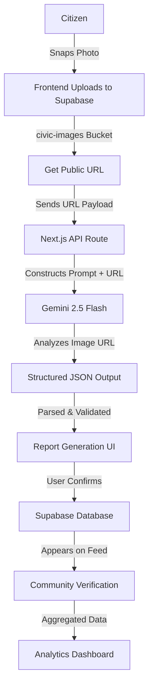

# CivicMind AI - AI Workflow & Blueprint

## 1. AI Vision
In CivicMind AI, artificial intelligence is the primary friction-remover. Traditional civic reporting fails because users abandon tedious, multi-step forms. The AI exists to transform a single action (taking a photo) into a fully categorized, actionable, and structured civic report. By leveraging Google Gemini 2.5 Flash, the platform guarantees that every report is standardized, severity-assessed, and instantly ready for community verification and municipal review.

## 2. End-to-End AI Workflow


## 3. AI System Architecture
- **Frontend (Next.js):** Handles image capture, compression, and direct secure upload to the Supabase `civic-images` storage bucket, bypassing Vercel payload limits.
- **API Layer (Next.js Routes):** Acts as the secure broker. It receives the public image URL, injects the system prompt, securely calls Google AI Studio, and parses the response.
- **Gemini (Google AI Studio):** The intelligence layer. Fetches the image via URL and uses multimodal capabilities to analyze visual severity and context.
- **Database & Storage (Supabase):** Storage hosts the images (`civic-images`), while the database stores the final JSON attributes (category, severity, AI confidence) alongside the issue record.

## 4. AI Reporting Pipeline
1. **Image Upload:** User captures a photo via device camera.
2. **Image Validation:** Client-side check (size < 5MB, valid MIME type like JPEG/PNG).
3. **Supabase Storage:** Image is uploaded directly to the `civic-images` bucket. A public URL is returned.
4. **Prompt Construction:** The API route receives the URL and combines it with a rigid System Prompt.
5. **Gemini Analysis:** The API securely sends the URL to Gemini 2.5 Flash for analysis.
6. **JSON Parsing:** The API receives the stringified JSON and parses it using `JSON.parse()`.
7. **Confidence Scoring:** Validates the AI's self-reported confidence score against predefined thresholds.
8. **Report Generation:** Frontend receives the JSON and auto-fills the report form for user confirmation.

## 5. Gemini Prompt Engineering Strategy

**System Prompt:**
> You are CivicMind AI, an expert municipal infrastructure analyzer. Your task is to analyze images uploaded by citizens and identify civic issues (e.g., potholes, garbage, broken streetlights, water leaks). You must return ONLY a raw, valid JSON object without any markdown formatting, backticks, or extra text. If no issue is found, return a JSON object with 'category': 'None' and 'severity': 'Low'.

**User Prompt:**
> Please analyze this image and generate a structured civic issue report based on the provided schema.

**Safety Rules:**
- Do not identify or store PII (Personally Identifiable Information) such as faces or license plates. If visible, ignore them.
- Do not generate harmful, biased, or inappropriate text.

**Output Rules:**
- The output MUST be strictly valid JSON.
- Do not wrap the JSON in ```json blocks.

**Validation Rules:**
- The API layer will run the response through a Zod schema to ensure all keys exist and match the expected enums.

## 6. Structured Output Design
Final JSON schema expected from Gemini:
```json
{
  "title": "Short, descriptive title of the issue (Max 50 chars)",
  "description": "Detailed explanation of the problem observed in the image",
  "category": "Infrastructure | Sanitation | Water | Electricity | Safety | Other",
  "severity": "Low | Medium | High | Critical",
  "recommended_department": "Name of the municipal department responsible (e.g., Public Works)",
  "confidence_score": 0.95
}
```

## 7. AI Confidence Framework
Gemini will assign a `confidence_score` between 0.0 and 1.0. The platform responds as follows:
- **Critical (0.90 - 1.0):** AI is highly certain. The report form is pre-filled and requires minimal user intervention.
- **High (0.75 - 0.89):** AI is confident. Auto-fill occurs, but the UI subtly nudges the user to verify the category.
- **Medium (0.50 - 0.74):** AI is unsure. The form auto-fills but presents a warning banner: *"AI is uncertain about this issue. Please double-check the details."*
- **Low (< 0.50):** AI failed to identify a clear issue. The form is left blank for manual user entry, and the image is flagged as `is_ai_analyzed = false`.

## 8. AI Error Handling
- **Invalid Image:** API returns HTTP 400. Frontend prompts: *"Please upload a valid JPEG/PNG."*
- **No Issue Found:** Gemini returns category 'None'. Frontend prompts: *"We couldn't detect a clear issue. Please describe it manually."*
- **Low Confidence:** Enforces manual entry fallback (see Confidence Framework).
- **Timeout:** If Gemini takes > 10s, API aborts. Frontend prompts: *"AI analysis timed out. Proceeding to manual entry."*
- **API Failure:** Catch block handles 500s. Frontend gracefully falls back to manual entry with a toast message: *"AI service currently unavailable."*

## 9. AI Security
- **Prompt Injection Protection:** The System Prompt is hardcoded on the server. The User Prompt only accepts the Supabase image URL, preventing users from appending text to hijack the AI instructions.
- **Input Validation:** Zod schema sanitizes the AI's JSON output before it is sent to the client or saved in the database.
- **Rate Limiting:** Vercel Edge Middleware limits the `/api/analyze` route to 5 requests per IP per minute.
- **API Security:** `GEMINI_API_KEY` is stored as an encrypted server-side environment variable and is never shipped to the client.

## 10. Future AI Roadmap
- **Predictive Civic Intelligence:** Analyzing heatmaps to predict where the next pothole or water leak will occur based on historical AI data.
- **Issue Clustering:** AI detects if multiple users are uploading photos of the exact same pothole from different angles, automatically merging them to prevent duplicates.
- **Multilingual AI:** Translating AI-generated descriptions into regional languages automatically to support diverse communities.
- **Authority Recommendations:** Generating automated email templates directly to the predicted municipal department based on AI categorization.

## 11. Final AI Architecture Summary
The CivicMind AI workflow is designed for speed, resilience, and strict structural compliance. By transitioning to a URL-based Supabase Storage workflow (`civic-images` bucket), the system completely eliminates Vercel payload limits and slow base64 conversions. Gemini 2.5 Flash acts as a secure, highly accurate engine for transforming citizen photos into standardized civic data, backed by strict Zod validation and confidence thresholds. This guarantees enterprise-grade scalability and reliability without blocking the user experience.
