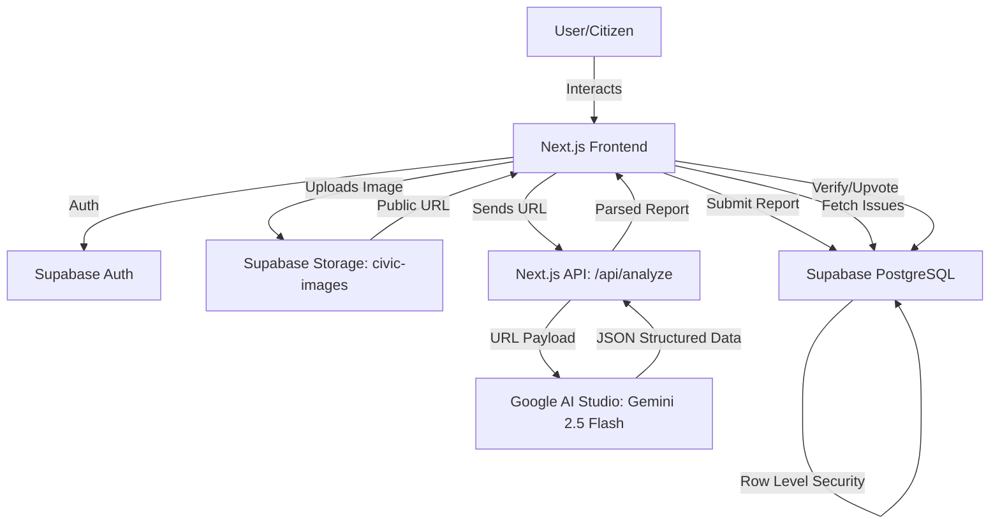

# CivicMind AI - Technical Architecture Document

## 1. Executive Technical Overview
CivicMind AI is a modern, serverless Next.js web application designed to empower communities to report and resolve local issues. It bridges citizens with civic data using AI. The frontend relies on Next.js 15 (App Router), Tailwind CSS, and Shadcn UI for rapid, responsive UI development. The backend leverages Next.js API Routes to securely orchestrate image processing via Google AI Studio (Gemini 2.5 Flash). All persistent state, including relationships, gamification, and authentication, is managed by Supabase PostgreSQL, secured by Row Level Security (RLS). Deployment is handled via Vercel for CI/CD and edge delivery.

## 2. System Architecture
User → Frontend (Next.js App) → Supabase Storage → API Routes (Next.js Server) → Gemini (AI Analysis) → Supabase (Database/Auth) → Dashboard/Map (Frontend Views)

The flow is unidirectional:
1. User interacts with the Next.js Client.
2. Image is uploaded directly to Supabase Storage (`civic-images` bucket).
3. The returned public Image URL is sent to Next.js API routes (keeping API keys hidden).
4. The API route calls the Gemini API, passing the URL for intelligence.
5. The API route or Client directly (via Supabase JS) interacts with the Supabase Database.
6. The Client updates its state based on Supabase real-time updates or fetched data.

## 3. High-Level Architecture Diagram


## 4. Component Architecture
- **Landing Page:** Public marketing page highlighting the value prop and driving users to sign up.
- **Authentication:** Supabase Auth UI integration handling login, signup, and session management.
- **Report Issue:** Core module containing the camera capture, image upload, AI state management, and the form submission logic.
- **Community Feed:** A scrollable list component rendering `IssueCard` components fetched from Supabase.
- **Map:** Leaflet container component plotting `issues` based on latitude/longitude.
- **Dashboard:** Renders `StatCard` and chart components based on aggregated `analytics_events` and issue metrics.
- **Profile:** Displays user data, total reputation points, and a grid of earned `badges`.
- **Verification System:** An isolated upvote/downvote component attached to issues, communicating directly with the `verifications` table.

## 5. Frontend Architecture
- **App Router Structure:** Uses Next.js `/app` directory for routing (`/`, `/login`, `/app/report`, `/app/map`, etc.).
- **Layouts:** `app/layout.tsx` for global providers (Supabase Auth Context, Theme Provider). `app/(dashboard)/layout.tsx` for the protected dashboard shell (Sidebar/Bottom Tabs).
- **Components:** Dumb UI components (Shadcn) reside in `/components/ui`. Smart components (e.g., `IssueCard`, `DynamicMap`) in `/components`.
- **Feature Modules:** Specific logic separated into `/features/report`, `/features/map` to avoid bloated pages.
- **Hooks:** Custom hooks (e.g., `useAuth`, `useIssues`, `useLocation`) in `/hooks`.
- **Services:** External API clients (Supabase client initialization, Gemini wrappers) in `/services`.
- **Utilities:** Formatting dates, distances, classNames (`cn`) in `/utils`.

## 6. Backend Architecture
- **API Routes:** Stored in `/app/api/...`. Acts as a secure proxy.
- **Request Flow:** Next.js Request → API Route → Auth Check (Supabase Server Client) → External API/DB → Next.js Response.
- **Validation:** Zod schemas used to validate incoming JSON payloads before processing.
- **Error Handling:** Standardized JSON error responses (`{ error: string, code: number }`).
- **Security:** API keys (Gemini) are strictly stored in `.env.local` and never exposed to the client. Route handlers verify Supabase session tokens before executing.

## 7. AI Architecture
**Workflow:**
1. Image Upload via browser `<input type="file" capture="environment">`.
2. Image is directly uploaded to Supabase Storage (`civic-images` bucket) using the Supabase JS client.
3. The public image URL is retrieved and sent to `/api/analyze`.
4. API constructs prompt: *"Analyze this image of a civic issue. Return a JSON object with 'title', 'description', 'category' (Infrastructure, Sanitation, Water), and 'severity' (Low, Medium, High, Critical)."*
5. Gemini 2.5 Flash processes the image from the URL and returns structured JSON.
6. API parses JSON and returns to client.

**Fallback Strategy:** If AI fails or returns invalid JSON, the frontend falls back to an empty manual entry form.

## 8. Database Architecture Mapping
- `users` → Profile page, Author tags on feeds, Leaderboard.
- `issues` → Map Pins, Community Feed cards, Dashboard totals.
- `issue_images` → Issue Detail carousel, Report Issue thumbnails.
- `verifications` → Upvote buttons on Community Feed, Trust Score calculation.
- `comments` → Issue Detail discussion thread.
- `notifications` → Navigation bell icon, toast popups.
- `badges` & `user_badges` → Profile gamification section.
- `analytics_events` → Dashboard charts, platform health monitoring.

## 9. Authentication Architecture
- **Supabase Auth:** Email/Password and OAuth (Google).
- **Protected Routes:** Next.js Middleware intercepts requests to `/app/*` and redirects to `/login` if no active session exists.
- **User Sessions:** Managed via Supabase Auth Helpers for Next.js (SSR compatible).
- **Security Model:** RLS policies in PostgreSQL ensure the DB rejects unauthorized operations regardless of frontend bugs.

## 10. Geolocation Architecture
- **Browser Geolocation:** `navigator.geolocation.getCurrentPosition()` used during "Report Issue" to snap coordinates.
- **Manual Location:** Map component allows users to drag a pin if browser GPS is inaccurate.
- **OpenStreetMap:** Free map tile provider.
- **Leaflet Rendering:** `react-leaflet` wrapped in a dynamic import (`ssr: false`) to prevent Next.js server rendering errors.

## 11. Analytics Architecture
- **Event Tracking:** `POST /api/analytics` called asynchronously during key actions (e.g., successful issue report).
- **Dashboard Metrics:** Server components fetch aggregations (e.g., `COUNT(id) FROM issues WHERE status = 'Resolved'`).
- **Aggregation Flow:** Supabase RPC (Remote Procedure Calls) or complex SQL views can be created for real-time dashboard data without slowing down transaction tables.

## 12. Gamification Architecture
- **Points:** Integer `reputation_points` on the `users` table incremented via secure trigger or backend API when an issue is verified.
- **Reputation:** Determines user tier (e.g., "Newcomer", "Civic Hero").
- **Badges:** Static rows in `badges`. Earned via business logic matching user stats against `points_required`.
- **Leaderboard:** Simple SQL `ORDER BY reputation_points DESC LIMIT 10`.

## 13. API Inventory

| Method | Endpoint | Purpose |
|---|---|---|
| POST | `/api/analyze` | Receives base64 image, returns Gemini AI structured JSON. |
| POST | `/api/report` | Creates a new issue in Supabase (if bypassing direct client insert). |
| GET | `/api/issues` | Fetches issues (alternative to Supabase client fetching). |
| POST | `/api/verify` | Submits an upvote/downvote for an issue. |
| POST | `/api/analytics` | Logs an event to the `analytics_events` table. |

*(Note: Many operations will use the Supabase JS client directly via RLS, reducing the need for custom API routes).*

## 14. Folder Structure
```
web/
├── app/
│   ├── api/
│   │   ├── analyze/route.ts
│   │   ├── verify/route.ts
│   │   └── analytics/route.ts
│   ├── (auth)/
│   │   ├── login/page.tsx
│   │   └── register/page.tsx
│   ├── (dashboard)/
│   │   ├── report/page.tsx
│   │   ├── map/page.tsx
│   │   ├── dashboard/page.tsx
│   │   ├── profile/page.tsx
│   │   ├── feed/page.tsx
│   │   └── layout.tsx
│   ├── layout.tsx
│   └── page.tsx
├── components/
│   ├── ui/
│   ├── IssueCard.tsx
│   ├── DynamicMap.tsx
│   └── StatCard.tsx
├── features/
│   ├── report/
│   ├── map/
│   ├── dashboard/
│   └── verification/
├── services/
│   ├── supabase.ts
│   └── gemini.ts
├── hooks/
│   ├── useLocation.ts
│   └── useIssues.ts
├── types/
│   └── database.ts
└── utils/
    ├── cn.ts
    └── format.ts
```

## 15. Security Architecture
- **API Key Security:** `GEMINI_API_KEY` exists only on Vercel Node runtime.
- **Environment Variables:** `NEXT_PUBLIC_SUPABASE_URL` and `NEXT_PUBLIC_SUPABASE_ANON_KEY` exposed safely.
- **RLS Policies:** Default deny all. Explicit policies written for `SELECT`, `INSERT`, `UPDATE` based on `auth.uid()`.
- **Input Validation:** Zod validates frontend forms and API JSON payloads.
- **Rate Limiting:** Vercel Edge Middleware limits `/api/analyze` requests to prevent AI cost abuse.

## 16. Scalability Architecture
- **Post-Hackathon:** Introduce PostGIS extension in Supabase for advanced radius searching (e.g., "Issues within 5km"). 
- **Storage:** Expand Supabase Storage usage with image transformations (e.g., automated thumbnails, webp compression) to save bandwidth.
- **Webhooks:** Use Supabase Database Webhooks to push newly verified issues directly to local municipal API endpoints.

## 17. Deployment Architecture
- **GitHub:** Source control repository.
- **Vercel:** Triggers build on push to `main`. Deploys Next.js Serverless Functions globally.
- **Supabase:** Hosted database in the cloud (AWS/GCP), handling DB connections and Auth state.
- **Gemini:** Google Cloud / AI Studio endpoint pinged securely from Vercel edge functions.

## 18. MVP Boundaries
**Build Now:**
- Gemini Vision Image-to-JSON reporting.
- Leaflet Interactive Map.
- Supabase Auth & Issue Storage.
- Basic Community Feed & Upvoting.

**Build Later:**
- Real-time chat/comments.
- Deep government API integration.
- Native iOS/Android builds.
- Complex routing algorithms for municipal workers.

## 19. Technical Risks
- **Risk:** Gemini Vision timeouts on large image uploads.
  - **Mitigation:** Resize/compress images on the client (using Canvas API) before sending to `/api/analyze`.
- **Risk:** Next.js SSR crashes with React Leaflet.
  - **Mitigation:** Strictly use `next/dynamic` with `{ ssr: false }`.
- **Risk:** Complex Supabase joins slowing down the Feed.
  - **Mitigation:** Maintain denormalized `upvotes_count` and `comments_count` on the `issues` table.

## 20. Final Architecture Summary
The CivicMind AI architecture is an optimized, serverless pipeline designed for maximum speed and scale during the VibeToShip 2026 Hackathon. By cleanly separating concerns—Next.js for the presentation layer, Gemini for intelligence, and Supabase for secure state management—the MVP delivers a highly interactive, location-aware civic platform. The design is secure via RLS, scalable via Vercel, and deeply aligned with the PRD and Database schema to guarantee a unified, frictionless development experience.
